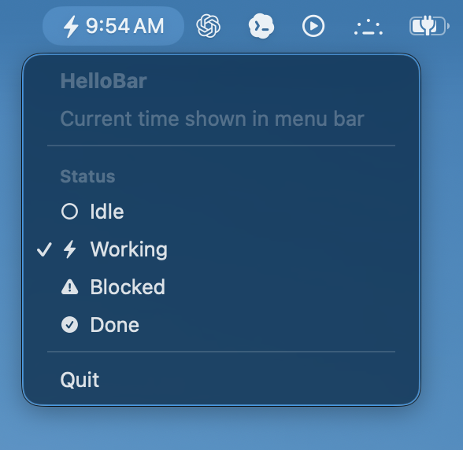

# HelloBar

A small macOS menu bar app built with SwiftUI. Just a playground for learning.

Right now it shows the current time in the menu bar with a simple status icon. Click the menu bar item to switch between Idle, Working, Blocked, and Done.

## Screenshot

Add a screenshot here when the app has one:



## Run

Open `HelloBar.xcodeproj` in Xcode, select the `HelloBar` scheme, and press `Cmd+R`.

## Structure

```text
HelloBar/
  HelloBarApp.swift        App entry point
  ContentView.swift        Menu popover
  TimeMenuBarLabel.swift   Menu bar label
  BarStatus.swift          Status options
  Assets.xcassets/         App assets

docs/screenshots/          Future screenshots
```

## License

MIT
